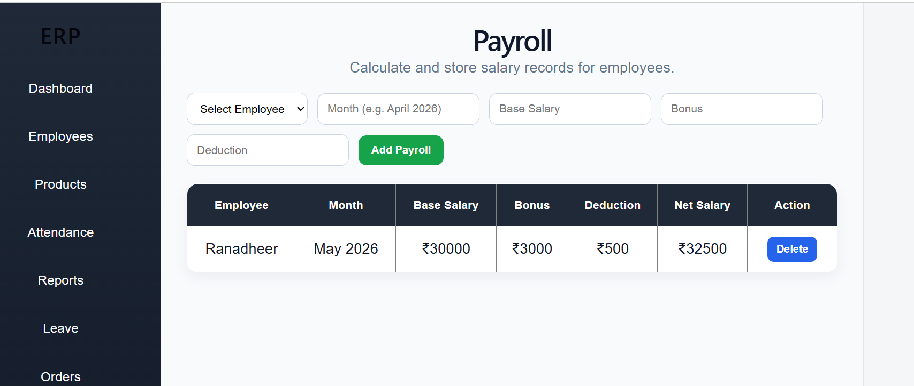
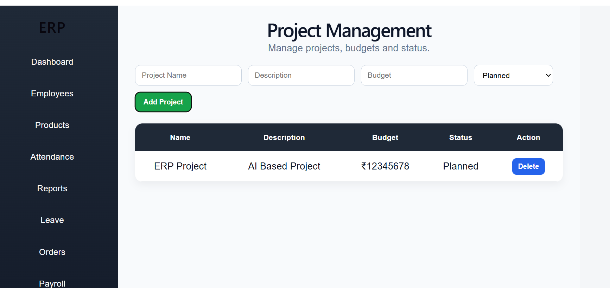
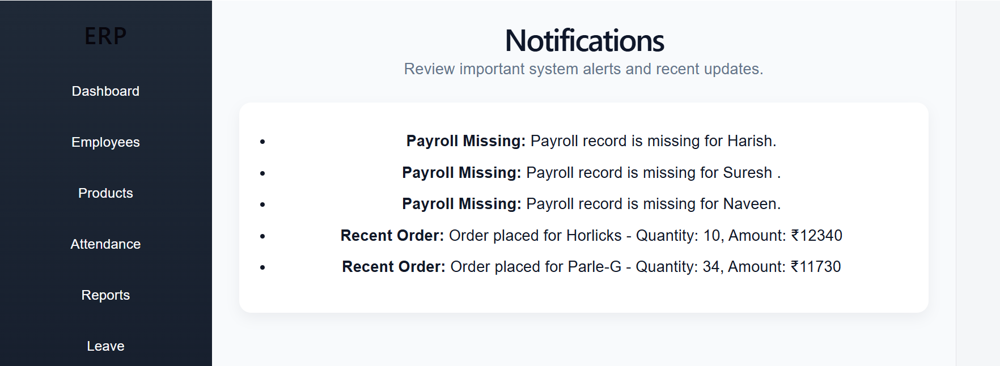
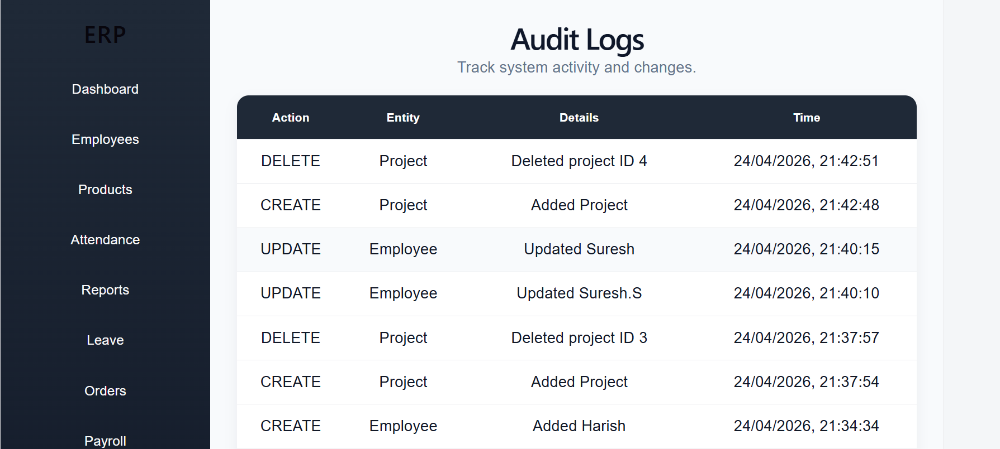

# ERP Management System

## 📌 Overview
This is a full-stack ERP (Enterprise Resource Planning) system developed to manage business operations like employees, inventory, attendance, leave management, payroll, projects, notifications, audit logs, reports, and sales.

The system provides real-time updates and integrates all modules into a single platform.

---

## 🚀 Features

### 🔐 Authentication
- Simple login system to access ERP dashboard

### 📊 Dashboard
- Employees count
- Products count
- Low stock alerts
- Attendance summary
- Sales summary
- Payroll summary
- Notifications count
- Audit log tracking

### 👨‍💼 Employee Management
- Add employees
- Update employees
- Delete employees
- Search employees
- Sort employees

### 📦 Inventory Management
- Add products with price, quantity, and reorder level
- Update products
- Delete products
- Low stock detection
- Stock status display

### 🕒 Attendance
- Mark employee attendance
- Present / Absent / Leave status
- View attendance records

### 📝 Leave Management
- Apply leave requests
- Track leave status
- Pending / Approved / Rejected status

### 💰 Orders / Sales
- Create sales orders
- Auto stock reduction after order
- Prevent orders when stock is insufficient
- View order history

### 💵 Payroll
- Add employee payroll
- Base salary, bonus, and deduction
- Net salary calculation
- View payroll records

### 📁 Project Management
- Add projects
- Manage project budget
- Track project status
- Delete projects

### 🔔 Notifications
- Low stock alerts
- Pending leave alerts
- Recent order notifications
- Payroll-related alerts

### 🧾 Audit Logs
- Track system actions
- Store activity logs
- View create, update, and delete actions

### 📈 Reports
- Inventory summary
- Attendance summary
- Leave summary
- Sales summary
- Payroll summary
---

## 📷 Screenshots

### Dashboard


### Employees


### Products


### Attendance


### Leave


### Orders


### Payroll


### Projects


### Notifications


### Audit Logs


### Reports


---

## 🎥 Demo Video
[Watch Demo Video](https://drive.google.com/file/d/12g1js7AObNIlW4wEZZPctGi8LABWuaCk/view?usp=drive_link)

---

## 🛠️ Technologies Used

### Frontend
- React.js
- CSS

### Backend
- Node.js
- Express.js

### Database
- Prisma ORM
- PostgreSQL / SQLite

---

## 🔗 API Endpoints

- `/employees`
- `/products`
- `/attendance`
- `/leave-requests`
- `/orders`
- `/payroll`
- `/projects`
- `/notifications`
- `/audit-logs`

---

## ⚙️ Installation & Setup

### Backend Setup
```bash
cd Backend
npm install
node server.js