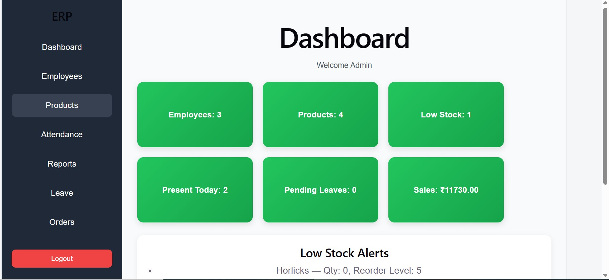
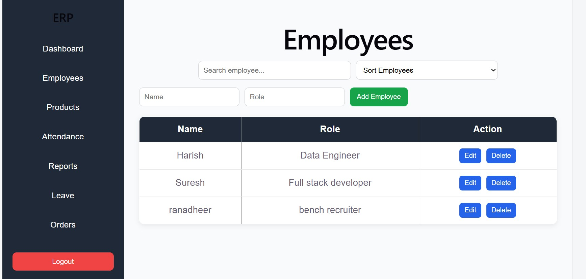
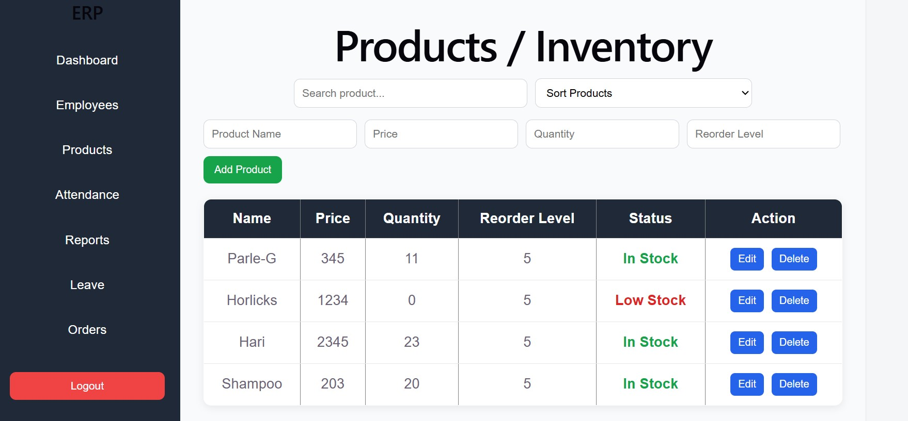
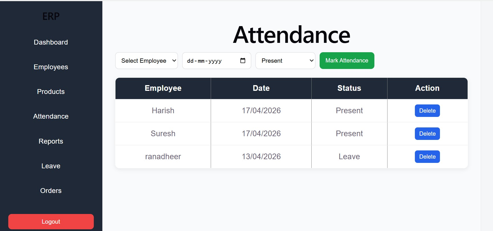
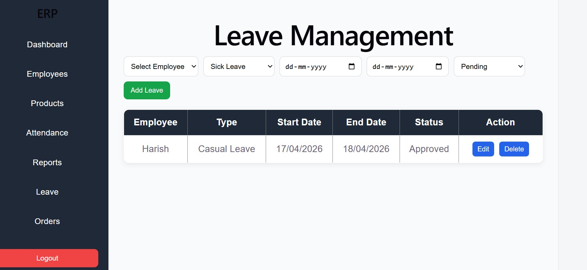
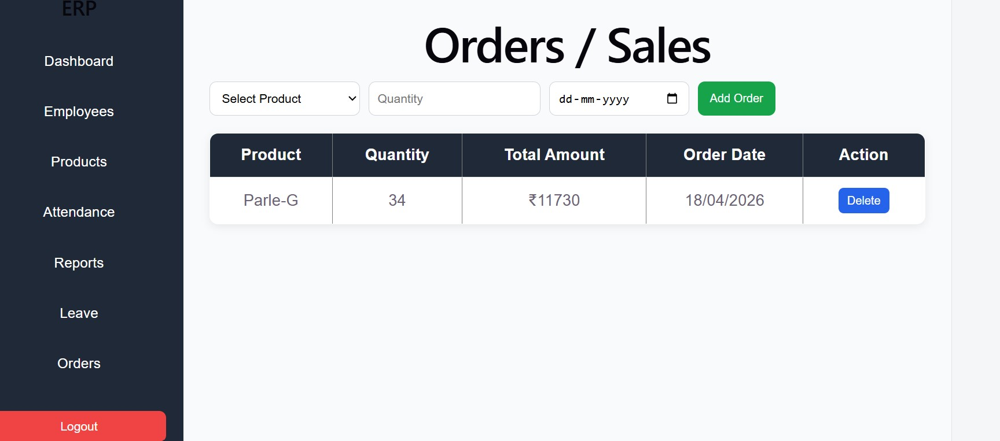
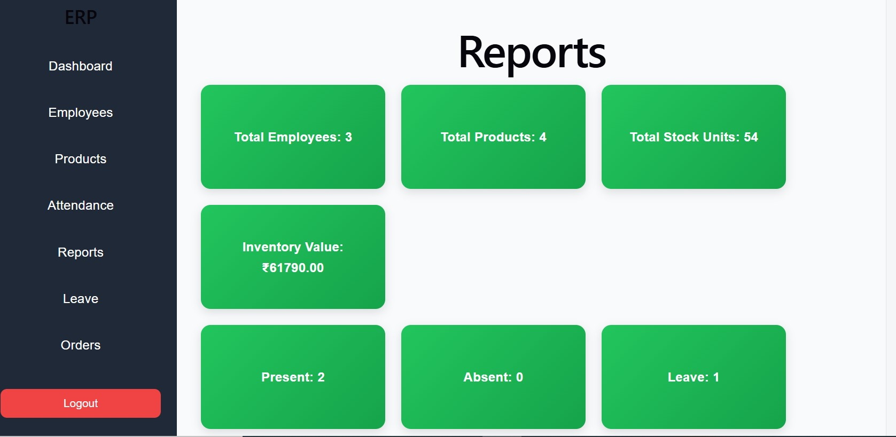

# ERP Management System

## 📌 Overview
This is a full-stack ERP (Enterprise Resource Planning) system developed to manage business operations like employees, inventory, attendance, leave management, and sales.

The system provides real-time updates and integrates all modules into a single platform.

---

## 🚀 Features

### 🔐 Authentication
- Simple login system to access the application

### 📊 Dashboard
- Displays:
  - Total employees
  - Total products
  - Low stock alerts
  - Attendance summary
  - Sales summary

### 👨‍💼 Employee Management
- Add, update, delete employees
- Search and sort functionality

### 📦 Inventory Management
- Add products with:
  - Price
  - Quantity
  - Reorder level
- Automatic low stock detection

### 🕒 Attendance Management
- Mark attendance:
  - Present
  - Absent
  - Leave
- View attendance records

### 📝 Leave Management
- Apply leave requests
- Track status:
  - Pending
  - Approved
  - Rejected

### 💰 Orders / Sales
- Create orders
- Automatic stock reduction
- Prevents ordering when stock is insufficient

### 📈 Reports
- View:
  - Inventory summary
  - Attendance summary
  - Leave summary
  - Sales summary

---

## 🛠️ Technologies Used

### Frontend
- React.js
- CSS

### Backend
- Node.js
- Express.js

### Database
- Prisma ORM

---

## ⚙️ Installation & Setup

### Backend Setup
## 📷 Screenshots

### Dashboard

### Employees

### Products

### Attendance

### Leave

### Orders

### Reports

## ✅ Conclusion

This ERP system successfully integrates multiple business modules into a single platform. It demonstrates full-stack development skills, API integration, database handling, and real-time data management.